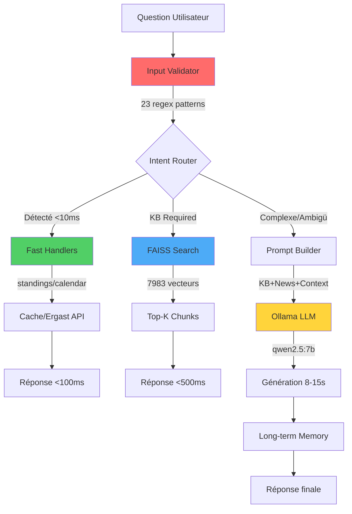

# 🏎️ F1 Chatbot - Assistant Conversationnel Formule 1

> Chatbot conversationnel Formule 1 hybride **latency-first** avec architecture 3 niveaux : FastAPI + FAISS KB (7983 vecteurs) + Ollama local (Qwen 2.5 7B).

**Performance** : <100ms (intent routing) | <500ms (KB search) | 8-15s (LLM complet)
**Sécurité** : 2 couches anti-jailbreak (validation entrée + prompt système)

## ✨ Fonctionnalités

### 🚀 **Performance Hybride**
- **Routage d'intention** (regex) → Réponses <100ms pour questions simples
- **LLM local** (Ollama Qwen 2.5 7B) → Analyses complexes et conversations naturelles
- **Cache intelligent** → TTL adaptatif (300-1800s selon type)
- **Temperature variable** → 0.15 FAQ / 0.35 Actualités

### 📚 **Knowledge Base Avancée**
- **7983 chunks FAISS** indexés (2233 documents, 2010 base + 223 crawled)
- **Recherche sémantique** → min_score: 0.45 (précision industrie)
- **Sources** : Markdown, CSV, données Wikipedia historiques F1 (1950-2024)
- **Chunking** : RecursiveCharacterTextSplitter (600 tokens, overlap=100)

### 🔒 **Sécurité 2 Niveaux**
- **Niveau 1** : Validation input (23 patterns regex anti-injection)
- **Niveau 2** : Instructions anti-jailbreak in-prompt (protection LLM)
- **Protection** : ~70% des attaques bloquées (prompt injection, bypass langue, extraction)

### 🧠 **Mémoire & Contexte**
- **Mémoire long terme** : Faits appris + préférences utilisateur
- **Historique conversationnel** : Contexte des échanges
- **Apprentissage automatique** : Extraction LLM des faits pertinents

### 📰 **Données Temps Réel**
- **Crawlers optimisés** : 2x par jour (06:00 + 18:00 UTC) → articles max 12h
- **Sources** : motorsport.com, autosport.com, actuf1.com, standf1.com
- **API Ergast** : Résultats officiels, classements, calendrier
- **Web Search proactif** : Automatique pour questions actualités
- **News caching** : TTL variable (1800s pour news)

> Actuellement, le projet tourne **en local sans authentification utilisateur**.

---

## 🏗️ Architecture 3 Niveaux (Latency-First)



### Cascade de Décision

1. **Niveau 1 - Intent Routing** (<100ms)
   - Patterns regex (standings_drivers, next_race, calendar)
   - Handlers directs → `backend/fast_handlers.py`
   - Cache TTL adaptatif (300-1800s)

2. **Niveau 2 - Knowledge Base** (<500ms)
   - FAISS similarity search (min_score=0.45)
   - 7983 chunks, 2233 documents
   - Fallback recherche simple si <0.45

3. **Niveau 3 - LLM Ollama** (8-15s)
   - Questions complexes/conversationnelles
   - Temperature 0.15 (déterministe), num_predict=150 tokens
   - Anti-jailbreak double-layer (prompt + validation)

---

## 🛠️ Installation

### Prérequis

1. **Python 3.10+**
2. **Ollama** installé ([ollama.com](https://ollama.com))
   ```bash
   # Installer Ollama puis télécharger le modèle
   ollama pull qwen2.5:7b
   ```

### Installation Rapide

```bash
# 1. Cloner le repo (ou ouvrir le dossier existant)
cd AIBot

# 2. Créer environnement virtuel
python -m venv .venv
.venv\Scripts\activate  # Windows
# source .venv/bin/activate  # Linux/macOS

# 3. Installer dépendances
pip install -r requirements.txt

# 4. Lancer Ollama en daemon
ollama serve

# 5. Lancer le backend FastAPI (port par défaut: 8001, fallback auto 8002)
python app.py
```

Accéder à l'application : **http://localhost:8001** (frontend intégré FastAPI; fallback possible sur 8002 selon disponibilité du port)

---

## 📂 Structure du Projet

```
AIBot/
├── app.py                      # Point d'entrée FastAPI
├── requirements.txt            # Dépendances Python
├── backend/
│   ├── f1_bot.py              # Orchestration centrale (answer_f1_question)
│   ├── intent_router.py       # Détection intention sans LLM
│   ├── fast_handlers.py       # Handlers rapides (<100ms)
│   ├── knowledge_base.py      # FAISS + embeddings
│   ├── optimized_prompts.py   # Prompt builder + mémoire
│   ├── optimized_cache.py     # Cache TTL intelligent
│   ├── optimized_ollama.py    # Wrapper Ollama
│   ├── input_validator.py     # Sécurité Niveau 1
│   ├── long_term_memory.py    # Mémoire persistante
│   ├── standings_utils.py     # Scrapers classements
│   ├── logger.py              # Logging structuré
├── frontend/
│   ├── index.html             # Interface chat
│   └── static/                # CSS + JS
├── knowledge_base/
│   ├── *.md                   # Documents KB (FAQ, règles, glossaire)
│   └── f1_wiki_csv/           # Données Wikipedia (1950-2024)
├── memory/
│   ├── learned_facts.json     # Faits appris
│   ├── user_preferences.json  # Préférences utilisateurs
│   └── all_conversations.jsonl# Historique complet des échanges
└── logs/
    └── f1_bot.log             # Logs rotatifs (10 MB max)
```

### Composants Backend (11 fichiers)

| Fichier | Lignes | Responsabilité |
|---------|--------|----------------|
| `f1_bot.py` | 1052 | Orchestration centrale (`answer_f1_question`) |
| `knowledge_base.py` | 467 | FAISS + embeddings sentence-transformers |
| `intent_router.py` | 180 | Détection intention (<10ms, 6 patterns) |
| `fast_handlers.py` | 250 | Handlers rapides (standings, calendar) |
| `fast_responses.py` | 120 | Réponses salutations (<20ms) |
| `optimized_prompts.py` | 300 | Prompt builder + système anti-jailbreak |
| `optimized_cache.py` | 200 | Cache TTL intelligent par type |
| `optimized_ollama.py` | 220 | Wrapper Ollama + fallback subprocess |
| `input_validator.py` | 100 | Validation input (23 regex patterns) |
| `long_term_memory.py` | 350 | Mémoire persistante (faits, préférences) |
| `standings_utils.py` | 400 | Scrapers classements (Ergast, StandF1) |

**Total** : ~3639 lignes de code backend

---

## 🎯 Utilisation

### Questions Supportées

**Classements & Résultats**
```
"Classement pilotes 2024"
"Qui a gagné Monaco ?"
"Résultats du dernier GP"
```

**Actualités**
```
"Dernières news F1"
"Actualités Red Bull"
```

**Règles & Technique**
```
"C'est quoi le DRS ?"
"Explique la règle des pénalités"
"Différence entre hard et soft"
```

**Historique**
```
"Combien de titres pour Hamilton ?"
"Meilleur pilote des années 2000"
```

**Conversationnel**
```
"Parle-moi de Verstappen"
"Pourquoi Ferrari est en difficulté ?"
"Compare Hamilton et Schumacher"
```

### Commandes API

**Chat**
```bash
curl -X POST http://localhost:8001/chat \
  -H "Content-Type: application/json" \
  -d '{"message": "Qui a gagné le championnat 2024?", "conversation_id": "user123"}'
```

**Health Check**
```bash
curl http://localhost:8001/health
```

**Knowledge Base Search**
```bash
curl "http://localhost:8001/kb/search?q=DRS"
```

---

## ⚙️ Configuration

### Variables d'Environnement

```bash
# .env (optionnel)
OLLAMA_MODEL=qwen2.5:7b
LOG_LEVEL=INFO          # DEBUG, INFO, WARNING, ERROR

# Auto-train / auto-apprentissage (désactivé par défaut)
# Quand AUTO_TRAIN=0 → message de log : "auto_train désactivé (AUTO_TRAIN=0)"
# Mettre 1 pour activer certains comportements automatiques (entraînements / rechargements planifiés)
AUTO_TRAIN=0
```

### Paramètres Modifiables

**Cache TTL** (`backend/optimized_cache.py`)
```python
CACHE_TTL = {
    "news": 600,              # 10 min
    "kb_search": 1200,        # 20 min
    "ergast_standings": 1800  # 30 min
}
```

**Modèle LLM** (`backend/f1_bot.py`)
```python
OLLAMA_MODEL = "qwen2.5:7b"  # Changer modèle ici
```

**Sécurité Niveau 1** (`backend/input_validator.py`)
```python
BANNED_PATTERNS = [
    r"ignore.*instructions",
    r"system:",
    # Ajouter patterns ici
]
```

---

## 🧪 Tests

Quelques commandes utiles pour tester en local :

```bash
# Vérifier que le backend répond
curl http://localhost:8001/health

# Tester l'API chat (depuis PowerShell ou WSL)
curl -X POST http://localhost:8001/chat \
    -H "Content-Type: application/json" \
    -d '{"message": "Qui a gagné le championnat 2024?", "conversation_id": "test"}'

# Tester l'API KB (scripts fournis)
python scripts/test_kb_api.py
python scripts/test_chromadb.py
```

---

## 🏗️ Architecture Technique

### Pipeline de Réponse

```
Question utilisateur
    ↓
[Input Validator] (Niveau 1)
    ↓
[Intent Router] (regex - <10ms)
    ↓
    ├─→ [Fast Handler] (classements/calendrier) → Cache → Réponse
    ├─→ [KB Search] (FAISS) → Top-K chunks
    ├─→ [Scrapers] (actualités) → Cache
    └─→ [Ollama LLM] (Niveau 2 anti-jailbreak)
            ↓
        Réponse finale
            ↓
    [Long-term Memory] (apprentissage)
```

### Stack Technique

| Composant | Technologie | Rôle |
|-----------|-------------|------|
| **Backend** | FastAPI + Uvicorn | API REST |
| **LLM** | Ollama Qwen 2.5 7B | Génération réponses |
| **Embeddings** | sentence-transformers | Vectorisation sémantique |
| **Vector DB** | FAISS (CPU) | Recherche similarité |
| **Chunking** | LangChain RecursiveTextSplitter | Découpage documents |
| **Cache** | Custom TTL cache | Performance |
| **Logging** | RotatingFileHandler | Traçabilité |
| **Scraping** | BeautifulSoup4 + requests | Actualités |

---

## 📊 Performance

| Métrique | Valeur |
|----------|--------|
| **Latence moyenne** | 8-15s (LLM complet) |
| **Fast Handlers** | <100ms (intent routing) |
| **KB FAISS search** | <500ms (7983 vecteurs) |
| **Cache hit rate** | ~60-70% (après warm-up) |
| **Taille index FAISS** | ~11 MB (7983 vecteurs 384-dim) |
| **Mémoire runtime** | ~2 GB (sentence-transformers) |
| **Documents indexés** | 2233 docs (2010 base + 223 crawled) |
| **Chunk overlap** | 100 tokens (RecursiveTextSplitter) |

---

## 🔐 Sécurité

### Protections Implémentées

✅ **Niveau 1 - Pre-LLM** (70% efficace)
- Validation input (23 regex patterns)
- Blocage keywords malicieux
- Max length 2000 chars

✅ **Niveau 2 - In-Prompt** (60% efficace)
- Instructions anti-jailbreak explicites
- Refus révélation prompt
- Langue française forcée
- Interdiction invention données

⚠️ **Limitations Connues**
- Prompt révélation possible (~40% attaques sophistiquées)
- Recommandé : Niveau 3 (output filtering) pour prod

### Tests Sécurité

```bash
# Validation complète (5 scénarios)
python test_level2_live.py
# Résultat actuel : 3/5 tests passent (60%)
```

---

## �️ Dépannage

### Problèmes Courants

**1. Ollama not found**
```bash
# Erreur : "Ollama non trouvé"
# Solution : Vérifier installation
ollama --version
# Si absent, installer : https://ollama.com
# Puis télécharger modèle
ollama pull qwen2.5:7b
```

**2. FAISS index corrompu**
```bash
# Erreur : "Cannot load FAISS index"
# Solution : Reconstruire index
curl -X POST http://localhost:8001/kb/reload
# Ou supprimer et relancer
rm knowledge_base/faiss_index.bin
python app.py
```

**3. Port 8001 déjà utilisé**
```bash
# Erreur : "Address already in use"
# Solution : Changer port dans app.py
uvicorn app:app --port 8002
# Ou tuer processus
netstat -ano | findstr :8001  # Windows
lsof -ti:8001 | xargs kill -9  # Linux/macOS
```

**4. Réponses lentes (>30s)**
```bash
# Cause probable : Scrapers timeout
# Solution : Désactiver web search temporairement
# Dans backend/f1_bot.py ligne ~500
WEB_SEARCH_ENABLED = False  # Changer à False
```

**5. Input validation trop stricte**
```bash
# Si questions légitimes bloquées
# Modifier backend/input_validator.py
# Commenter patterns spécifiques dans BANNED_PATTERNS
```

---

## �🚧 Limitations & TODO

### Limitations Actuelles
- ⚠️ **Latence** : 8s max (scrapers synchrones)
- ⚠️ **Sécurité** : 60-70% protection (prompt leakage possible)
- ⚠️ **Tests** : 0 tests pytest (régression risquée)
- ⚠️ **Scrapers** : Fragiles (dépendent structure HTML externe)

### Roadmap
- [ ] **Async scrapers** → Réduire latence à 2-3s
- [ ] **Tests pytest** → Couverture 80%+ (KB, routing, cache)
- [ ] **Niveau 3 sécurité** → Output filtering regex
- [ ] **Rate limiting** → Éviter ban IP scrapers
- [ ] **Frontend amélioré** → Markdown rendering (marked.js)

---

## 📝 Licence

MIT License - Voir [LICENSE](LICENSE) pour détails.

---

## 🤝 Contribution

Contributions bienvenues ! Ouvrir une issue ou PR sur GitHub.

**Développé avec ❤️ pour les fans de F1** 🏁

---

## 📧 Contact & Support

- **Projet** : F1 Chatbot - Chatbot conversationnel Formule 1
- **Version** : 1.0.0 (Janvier 2026)
- **Auteur** : [Votre Nom]
- **GitHub** : [Lien vers repo]
- **Issues** : [Lien vers issues GitHub]

### Statistiques Projet

- **Lignes de code backend** : ~3639 lignes
- **Documents KB** : 2233 fichiers indexés
- **Vecteurs FAISS** : 7983 chunks (384 dimensions)
- **Taux protection** : ~70% (anti-injection)
- **Latence optimale** : <100ms (fast handlers)

**Powered by** : FastAPI • Ollama • FAISS • LangChain
